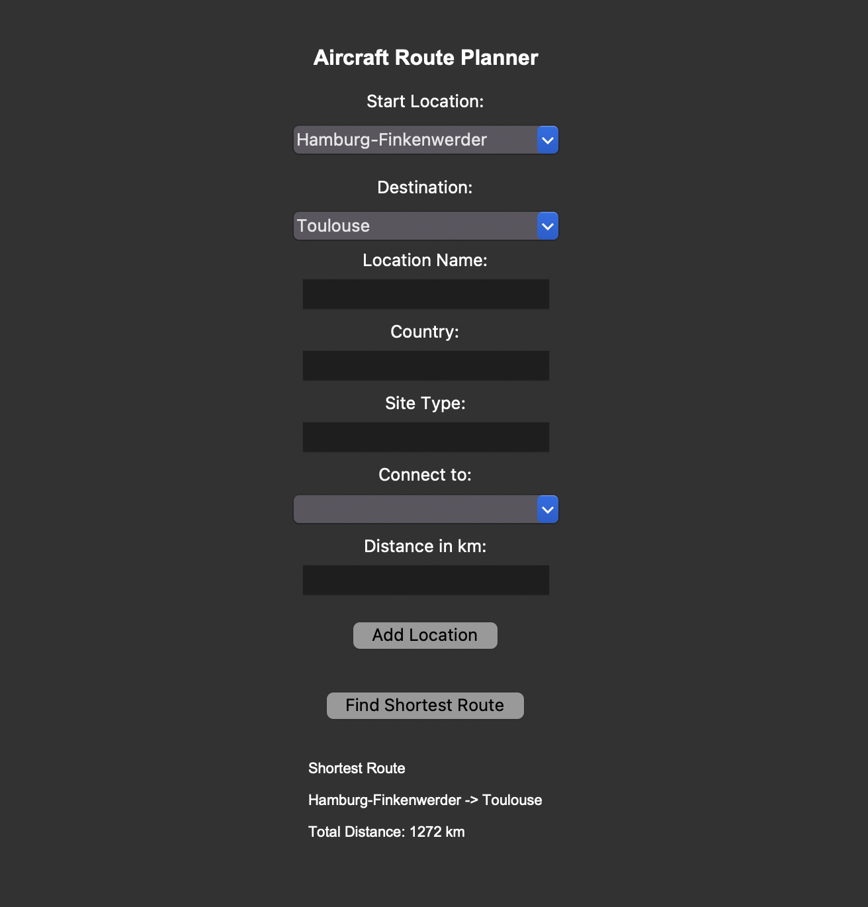

# Aircraft Route Planner

A Python desktop application that models the Airbus production network and calculates the shortest transport routes between locations.

## Overview

The Aircraft Route Planner represents Airbus manufacturing and engineering sites as a graph structure. Locations are connected through transport routes, allowing the application to calculate optimal paths between sites.

The project combines graph theory, object-oriented programming, and a graphical user interface built with Tkinter.

## Features

* Airbus location network
* Route availability checking using Breadth-First Search (BFS)
* Shortest path calculation using Dijkstra's Algorithm
* Route reconstruction and distance calculation
* Error handling for unreachable destinations
* Graphical user interface built with Tkinter
* Dynamic creation of new locations
* Automatic creation of transport connections

## Technologies Used

* Python
* Tkinter
* Object-Oriented Programming (OOP)
* Graph Data Structures
* Breadth-First Search (BFS)
* Dijkstra's Algorithm

## Screenshot



## Example Output

```text
Shortest Route

Hamburg-Finkenwerder -> Toulouse -> Mobile

Total Distance: 7432 km
```

## Airbus Locations Included

* Hamburg-Finkenwerder
* Toulouse
* Mobile
* Bremen
* Stade
* Broughton
* Getafe
* Filton

Additional locations can be added directly through the GUI.

## Future Improvements

* Interactive route visualization
* Map integration
* Import and export of network data
* Additional Airbus production sites

## Author

Malte Scherenberg
