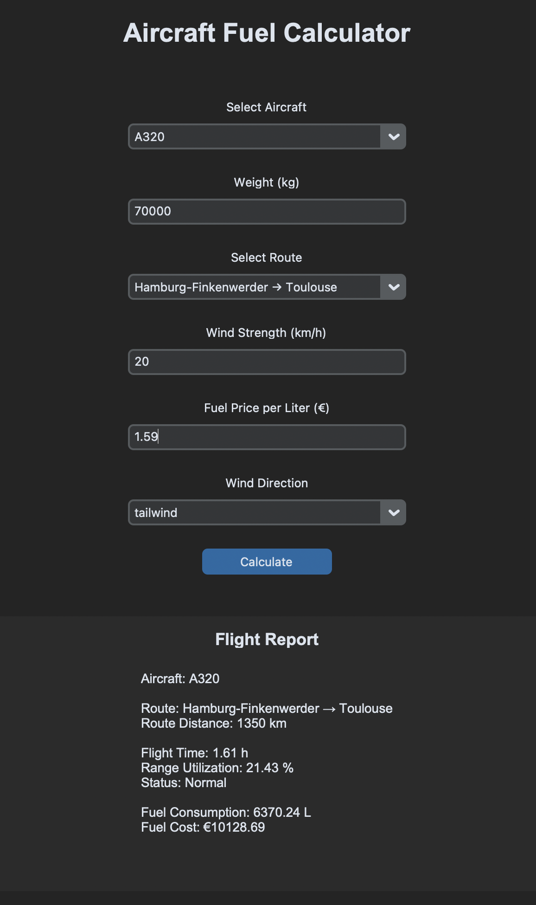

# Aircraft Fuel Calculator

## Description

Aircraft Fuel Calculator is a Python desktop application that estimates fuel consumption and fuel costs for different Airbus aircraft types based on route, aircraft weight, and wind conditions.

The application features a graphical user interface built with CustomTkinter and includes Airbus production and transport routes.

## Features

* Airbus A320, A330, and A350 support
* Airbus production route selection
* Automatic route distance calculation
* Fuel consumption estimation
* Fuel cost calculation
* Flight time estimation
* Range utilization analysis
* Flight status evaluation
* Maximum takeoff weight warning system
* Input validation
* Error handling with try/except
* CustomTkinter graphical user interface

## Technologies

* Python 3
* CustomTkinter
* PyInstaller
* Git & GitHub

## Example Routes

* Hamburg-Finkenwerder → Toulouse
* Toulouse → Getafe
* Broughton → Toulouse

## Screenshots

## Future Improvements

* Additional Airbus aircraft types
* More realistic fuel consumption models
* Weather integration
* Airport database
* Route planning features

## Author

Malte Scherenberg

