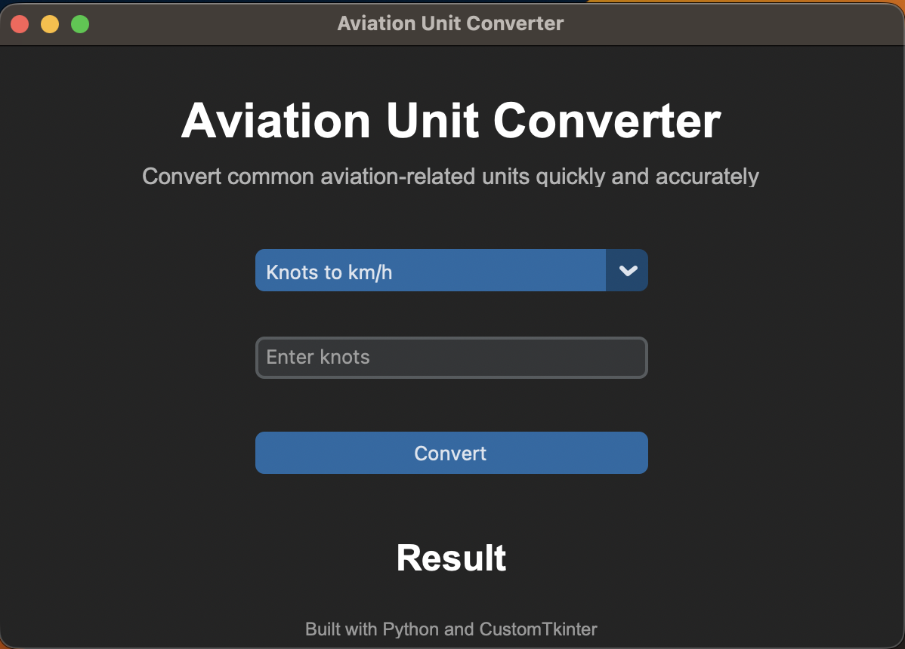

# Aviation Unit Converter

This desktop application converts common aviation-related units through an interactive graphical user interface. Users can select different conversion types via a dropdown menu and receive instant results. The application also includes input validation and error handling for invalid or negative values.

I built this project to strengthen my Python, GUI development, and software engineering skills.

---

## Screenshot



---

## Features

- Knots to km/h conversion
- Feet to meters conversion
- Gallons to liters conversion
- Dynamic input placeholders
- Input validation and error handling
- Responsive GUI built with CustomTkinter

---

## Technologies Used

- Python
- CustomTkinter

---

## How to Run

1. Clone the repository:

```bash
git clone <your-repository-url>
```

2. Navigate into the project folder:

```bash
cd Unit-Converter
```

3. Install CustomTkinter:

```bash
pip install customtkinter
```

4. Run the application:

```bash
python3 main.py
```

---

## What I Learned

Through this project, I practiced:

- GUI development with CustomTkinter
- Event-driven programming
- Input validation and error handling
- Structuring Python applications
- Working with Git and GitHub


